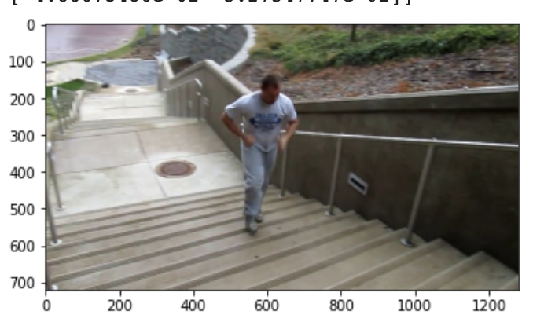
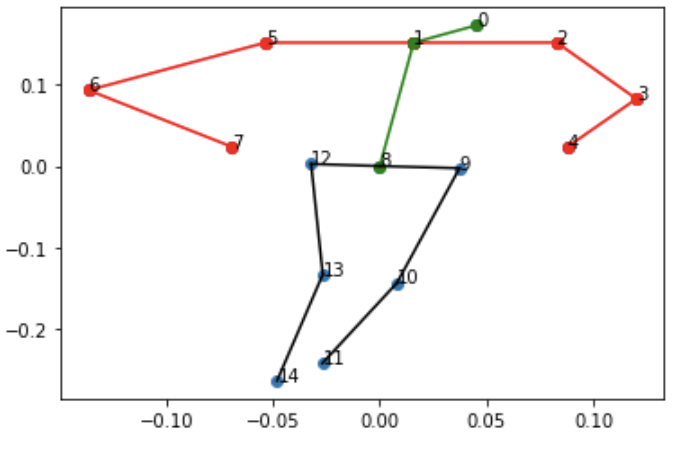
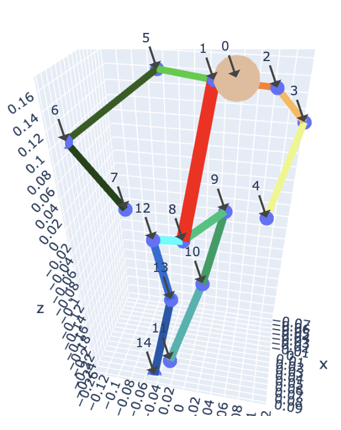

# 3D-Pose-Estimation
This repository contains all the necessary files required to implement  3-D pose estimation using GANs.

## Overview
This project aims to generate visually intuitive 3 Dimensional Pose estimations for humans from 2D RGB images. Most 3D pose estimation solutions require the use of 3D datasets, and a method that can convert 2D images to 3D key joint positions using only a 2D dataset requires additional algorithms and methods to accomplish the task. We achieve this by breaking down our project into three intermediate steps, namely (i) 2D key-point generation, (ii) conversion of 2D to 3D poses using Generative Adversarial Networks (GANs), and (iii) rendering the generated 3D poses for visually informative results. 

## Dataset
The 2D image dataset used to train and test the model for our project was the MPII dataset, which is a state-of-the-art benchmark for evaluation of articulated human pose estimation. It consists of 25K images and contains over 40K humans performing over 400 different activities. This gives us a variety of images to train on, with one or multiple people in the frame, along with poses where joint positions overlap or are presented differently, allowing us to test the robustness of the GANs model.
The MPII dataset can be found here: http://human-pose.mpi-inf.mpg.de/#overview

## Procedure
Perfom the following steps to implement the 3-D pose estimation:
#### 1. Download dataset
- Download the official MPII dataset from the link given above.
#### 2. Obtain 2-D joint locations using OpenPose
- Run the colab notebook Module1_OpenPose.ipynb giving the appropriate path to the MPII dataset downloaded.
- This script does 4 things:
    1) Creates the OpenPose model.
    2) Runs the OpenPose model on the input images to get images with the UI skeletons overlaid (only for visualization purpose. Can skip this part.)
    3) Runs the OpenPose model on the input images to get various joint locations and convert them into .json files.   
    4) With the help of these JSON files, we run a function that stores the results in a numpy format for ease of use during testing. Two numpy files are created:
        1) The joint locations (tuple (x,y,confidence)) stored as a numpy object.
        2) Corresponding image files names stored as a numpy object.
#### 3. Obtain 3-D human poses using GANs
- Run the colab notebook 3d_pose_estimation_GANs.ipynb giving appropriate paths to the various numpy files created in the previous step.
- This script runs the GANs model on the MPII dataset (now in numpy format) and stores the generator and discriminator model after training. These trained models can be accessed directly for consecutive testing purposes.
- It then provides visualizations of the results in 3D plots. 
- The results are stored in the end.

## Sample Result

    
    
    

 

